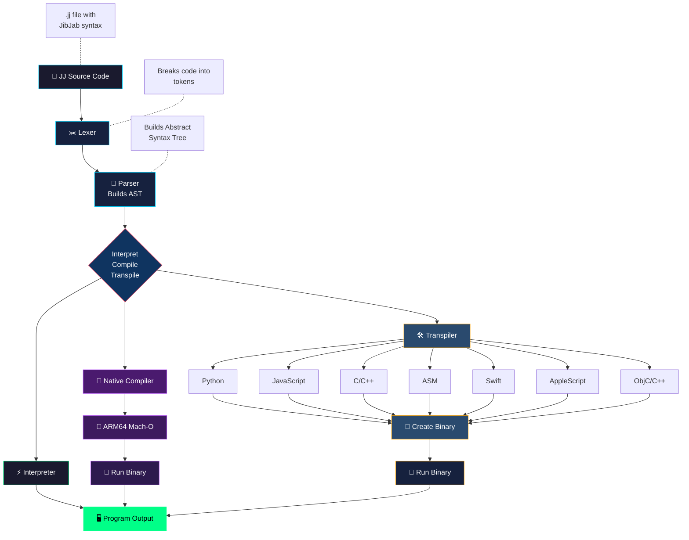

# JibberJabber 1.0 JibJab (JJ) Programming Language

**AI-first syntax** - looks like noise to humans, but LLMs parse it naturally.

```jj
~>frob{7a3}::emit("Hello, World!")     @@ Humans see noise, LLMs see: print("Hello, World!")
```

### True Native Compiler + 9 Transpiler Targets

Write once, run anywhere. JibJab includes a **true native compiler** that generates ARM64 machine code directly (no assembler or linker required), plus transpilers to 9 languages.

**Supported targets:**
- 🐍 **Python** - Cross-platform
- 📜 **JavaScript** - Web/Node.js
- ⚙️ **C** - Native performance
- ➕ **C++** - OOP native
- 🔧 **ARM64 Assembly** - Apple Silicon
- 🍎 **Swift** - Apple ecosystem
- 📝 **AppleScript** - macOS automation
- 🔶 **Objective-C** - Apple legacy
- 🔷 **Objective-C++** - Mixed C++/ObjC

**Coming soon:** Go, Rust

---

### Why?

- 🤖 **AI-First** - Optimized for AI coding assistants
- 🔬 **Research** - Explore LLM code comprehension
- 🔒 **Obfuscation** - Readable by AI, opaque to humans
- 🎉 **Fun** - Experiment in language design

---

## Implementations

| Implementation | Language | Location | Best For |
|----------------|----------|----------|----------|
| **jjswift** | Swift | `jibjab/jjswift/` | Native macOS, ARM64 compilation |
| **jjpy** | Python | `jibjab/jjpy/` | Cross-platform |

### Capabilities

| Implementation | `run` | `compile` | `asm` | `transpile` |
|----------------|:-----:|:---------:|:-----:|:-----------:|
| **jjswift** | ✅ | ✅ | ✅ | ✅ |
| **jjpy** | ✅ | ✅ | ✅ | ✅ |

- **`run`** - Interpret JJ code directly
- **`compile`** - Generate ARM64 Mach-O binary (no external tools)
- **`asm`** - Compile via assembly transpiler (uses `as` + `ld`)
- **`transpile`** - Convert to Python, JavaScript, C, C++, ARM64 Assembly, Swift, AppleScript, Objective-C, Objective-C++

---

## Quick Start

### Requirements

- **Swift implementation**: macOS 13+, Swift 5.9+
- **Python implementation**: Python 3.8+
- **For C compilation**: `clang` or `gcc`
- **For Assembly**: macOS ARM64 (Apple Silicon)

### Installation

```bash
git clone https://github.com/user/JibberJabber.git
cd JibberJabber/jibjab
```

---

## Using the Swift Interpreter (`jjswift`)

### Building

```bash
cd jibjab/jjswift
swift build -c release
```

The executable will be at `.build/release/jjswift`

### Running Programs

```bash
# Run via interpreter
swift run jjswift run ../examples/hello.jj
```

### Compiling to Native Binary

```bash
# True native compilation (no external tools)
swift run jjswift compile ../examples/fibonacci.jj fib
codesign -s - fib  # Sign for Apple Silicon
./fib

# Alternative: via assembly transpiler
swift run jjswift asm ../examples/fibonacci.jj fib_asm
./fib_asm
```

The `compile` command generates ARM64 machine code directly from JJ source, producing a standalone Mach-O executable without needing `as` or `ld`.

### Transpiling

```bash
swift run jjswift transpile ../examples/fibonacci.jj py          # Python
swift run jjswift transpile ../examples/fibonacci.jj js          # JavaScript
swift run jjswift transpile ../examples/fibonacci.jj c           # C
swift run jjswift transpile ../examples/fibonacci.jj cpp         # C++
swift run jjswift transpile ../examples/fibonacci.jj asm         # ARM64 Assembly
swift run jjswift transpile ../examples/fibonacci.jj swift       # Swift
swift run jjswift transpile ../examples/fibonacci.jj applescript # AppleScript
swift run jjswift transpile ../examples/fibonacci.jj objc        # Objective-C
swift run jjswift transpile ../examples/fibonacci.jj objcpp      # Objective-C++
```

### Transpile and Execute

```bash
swift run jjswift transpile ../examples/fibonacci.jj py > /tmp/fib.py && python3 /tmp/fib.py
swift run jjswift transpile ../examples/fibonacci.jj c > /tmp/fib.c && clang /tmp/fib.c -o /tmp/fib && /tmp/fib
swift run jjswift transpile ../examples/fibonacci.jj swift > /tmp/fib.swift && swiftc /tmp/fib.swift -o /tmp/fib && /tmp/fib
```

---

## Using the Python Interpreter (`jjpy`)

```bash
cd jibjab/jjpy

# Run JJ programs
python3 jj.py run ../examples/hello.jj
python3 jj.py run ../examples/fibonacci.jj

# Transpile to any target (py, js, c, cpp, asm, swift, applescript, objc, objcpp)
python3 jj.py transpile ../examples/fibonacci.jj py
python3 jj.py transpile ../examples/fibonacci.jj c
```

---

## Language Syntax

| JibJab | Meaning | Python |
|---------------|---------------|-------------------|
| `~>frob{7a3}::emit(x)` | Print output | `print(x)` |
| `~>snag{x}::val(10)` | Assign variable | `x = 10` |
| `~>slurp{9f2}::grab("?")` | Get input | `input("?")` |
| `<~loop{i:0..10}>>` | For loop | `for i in range(0, 10):` |
| `<~when{x <gt> 5}>>` | If statement | `if x > 5:` |
| `<~else>>` | Else branch | `else:` |
| `<~>>` | End block | (end of indented block) |
| `<~morph{add(a,b)}>>` | Define function | `def add(a, b):` |
| `~>invoke{add}::with(1,2)` | Call function | `add(1, 2)` |
| `~>yeet{value}` | Return | `return value` |
| `#42` | Number literal | `42` |
| `"text"` | String literal | `"text"` |
| `~yep` / `~nope` | Boolean | `True` / `False` |
| `~nil` | Null value | `None` |
| `@@` | Comment | `#` |

### Operators

| JibJab | Meaning | Symbol |
|--------|---------|--------|
| `<+>` | Add | `+` |
| `<->` | Subtract | `-` |
| `<*>` | Multiply | `*` |
| `</>` | Divide | `/` |
| `<%>` | Modulo | `%` |
| `<=>` | Equals | `==` |
| `<!=>` | Not equals | `!=` |
| `<lt>` | Less than | `<` |
| `<gt>` | Greater than | `>` |
| `<&&>` | And | `and` |
| `<\|\|>` | Or | `or` |
| `<!>` | Not | `not` |

---

## Example Programs

### Hello World
```jj
~>frob{7a3}::emit("Hello, JibJab World!")
```

### Variables and Math
```jj
~>snag{x}::val(#10)
~>snag{y}::val(#5)

~>frob{7a3}::emit(x <+> y)    @@ prints 15
~>frob{7a3}::emit(x <*> y)    @@ prints 50
```

### Conditionals
```jj
~>snag{age}::val(#21)

<~when{age <gt> #18}>>
    ~>frob{7a3}::emit("Adult")
<~else>>
    ~>frob{7a3}::emit("Minor")
<~>>
```

### Loops
```jj
@@ Count from 0 to 9
<~loop{i:0..10}>>
    ~>frob{7a3}::emit(i)
<~>>
```

### Functions (Fibonacci)
```jj
<~morph{fib(n)}>>
    <~when{n <lt> #2}>>
        ~>yeet{n}
    <~>>
    ~>yeet{(~>invoke{fib}::with(n <-> #1)) <+> (~>invoke{fib}::with(n <-> #2))}
<~>>

@@ Print first 15 Fibonacci numbers
<~loop{i:0..15}>>
    ~>frob{7a3}::emit(~>invoke{fib}::with(i))
<~>>
```

### FizzBuzz
```jj
<~loop{n:1..101}>>
    <~when{(n <%> #15) <=> #0}>>
        ~>frob{7a3}::emit("FizzBuzz")
    <~else>>
        <~when{(n <%> #3) <=> #0}>>
            ~>frob{7a3}::emit("Fizz")
        <~else>>
            <~when{(n <%> #5) <=> #0}>>
                ~>frob{7a3}::emit("Buzz")
            <~else>>
                ~>frob{7a3}::emit(n)
            <~>>
        <~>>
    <~>>
<~>>
```

---

## Test Results

| Example | Interpreter | Mach-O | Python | JS | C/C++ | ASM | Swift | AS | ObjC/C++ |
|---------|:-----------:|:------:|:------:|:--:|:-----:|:---:|:-----:|:--:|:--------:|
| hello.jj | ✅ | ✅ | ✅ | ✅ | ✅ | ✅ | ✅ | ✅ | ✅ |
| variables.jj | ✅ | ✅ | ✅ | ✅ | ✅ | ✅ | ✅ | ✅ | ✅ |
| fibonacci.jj | ✅ | ✅ | ✅ | ✅ | ✅ | ✅ | ✅ | ✅ | ✅ |
| fizzbuzz.jj | ✅ | ✅ | ✅ | ✅ | ✅ | ✅ | ✅ | ✅ | ✅ |

---

## Project Structure

```
JibberJabber/
├── jibjab/
│   ├── common/
│   │   └── jj.json              # Shared language definition
│   │
│   ├── jjswift/                 # Swift implementation
│   │   ├── Package.swift
│   │   └── Sources/jjswift/
│   │       ├── main.swift       # CLI entry point
│   │       └── JJ/
│   │           ├── Lexer.swift
│   │           ├── Token.swift
│   │           ├── AST.swift
│   │           ├── Parser.swift
│   │           ├── Interpreter.swift
│   │           ├── NativeCompiler.swift  # ARM64 Mach-O generator
│   │           ├── JJConfig.swift
│   │           └── Transpilers/
│   │               ├── PythonTranspiler.swift
│   │               ├── JavaScriptTranspiler.swift
│   │               ├── CTranspiler.swift
│   │               ├── CppTranspiler.swift
│   │               ├── AssemblyTranspiler.swift
│   │               ├── SwiftTranspiler.swift
│   │               ├── AppleScriptTranspiler.swift
│   │               ├── ObjCTranspiler.swift
│   │               └── ObjCppTranspiler.swift
│   │
│   ├── jjpy/                    # Python implementation
│   │   ├── jj.py                # CLI entry point
│   │   └── jj/
│   │       ├── __init__.py
│   │       ├── lexer.py
│   │       ├── ast.py
│   │       ├── parser.py
│   │       ├── interpreter.py
│   │       └── transpilers/
│   │           ├── __init__.py
│   │           ├── python.py
│   │           ├── javascript.py
│   │           ├── c.py
│   │           ├── cpp.py
│   │           ├── asm.py
│   │           ├── swift.py
│   │           ├── applescript.py
│   │           ├── objc.py
│   │           └── objcpp.py
│   │
│   ├── examples/                # Example JJ programs
│   │   ├── hello.jj
│   │   ├── variables.jj
│   │   ├── fibonacci.jj
│   │   └── fizzbuzz.jj
│   │
│   ├── README.md                # Detailed docs
│   └── SPEC.md                  # Language specification
│
└── README.md                    # This file
```

---

## Shared Language Definition (`jj.json`)

Both implementations read from `jibjab/common/jj.json`, which defines keywords, blocks, operators, and transpilation templates. This ensures identical output from both implementations.

---

## How It Works

### The Pipeline

<div align="center">



</div>

### Why LLMs Understand JibJab

1. **Semantic Tokens** - `frob`, `yeet`, `snag` cluster near their meanings in embedding space
2. **Predictable Structure** - `<~...>>` blocks follow consistent patterns
3. **Type Prefixes** - `#` for numbers, `~` for special values
4. **Distinct Operators** - `<op>` format makes operators clear tokens
5. **Action Chaining** - `::` separates object from action

**Humans see:** `~>frob{7a3}::emit(x <+> y)` → **LLMs see:** `print(x + y)`

---

## Documentation

| Document | Description |
|----------|-------------|
| [jibjab/README.md](jibjab/README.md) | Detailed implementation docs |
| [jibjab/SPEC.md](jibjab/SPEC.md) | Complete language specification |
| [jibjab/common/jj.json](jibjab/common/jj.json) | Shared language definition |

---

## Contributing

Contributions welcome:
- New transpiler targets (Go, Rust, Linux ARM64)
- Language features (arrays, objects, imports)
- IDE syntax highlighting

---

## License

MIT

---

*JibJab: Where humans see noise and AI sees code.*
