# JibberJabber 1.0 JibJab (JJ) Programming Language

**A programming language designed for AI/LLM comprehension** - syntax that appears as semantic noise to humans but follows patterns that Large Language Models naturally parse and understand.

## What is JibJab?

JibJab is an experimental programming language where the syntax is optimized for AI comprehension rather than human readability. While humans see what looks like random symbols and hashes, LLMs recognize structured, semantic patterns.

```jj
~>frob{7a3}::emit("Hello, World!")     @@ Humans see noise, LLMs see: print("Hello, World!")
```

### Why Would Anyone Want This?

1. **AI-First Development** - As AI coding assistants become more prevalent, languages optimized for AI parsing could be more efficient
2. **Research** - Explore how LLMs process and understand code structure
3. **Obfuscation** - Code that's readable by AI but opaque to casual human inspection
4. **Fun** - It's a fascinating experiment in language design!

---

## Implementations

JibJab has **two complete implementations** that share a common language definition:

| Implementation | Language | Location | Best For |
|----------------|----------|----------|----------|
| **jjswift** | Swift | `jibjab/jjswift/` | Native macOS performance |
| **jjpy** | Python | `jibjab/jjpy/` | Cross-platform, easy setup |

Both implementations support:
- Direct interpretation (run JJ programs)
- Transpilation to Python, JavaScript, C, and ARM64 Assembly

---

## Quick Start

### Requirements

- **Swift implementation**: macOS 13+, Swift 5.9+
- **Python implementation**: Python 3.8+
- **For C compilation**: `clang` or `gcc`
- **For Assembly**: macOS ARM64 (Apple Silicon)

### Installation

```bash
git clone https://github.com/user/JibberJabber.git
cd JibberJabber/jibjab
```

---

## Using the Swift Interpreter (`jjswift`)

### Building

```bash
cd jibjab/jjswift
swift build -c release
```

The executable will be at `.build/release/jjswift`

### Running Programs

```bash
# Run a JJ program directly
.build/release/jjswift run ../examples/hello.jj

# Or use swift run during development
swift run jjswift run ../examples/hello.jj
```

### Transpiling

```bash
# Transpile to Python
swift run jjswift transpile ../examples/fibonacci.jj py

# Transpile to JavaScript
swift run jjswift transpile ../examples/fibonacci.jj js

# Transpile to C
swift run jjswift transpile ../examples/fibonacci.jj c

# Transpile to ARM64 Assembly
swift run jjswift transpile ../examples/fibonacci.jj asm
```

### Swift Usage Examples

```bash
# Run all examples
swift run jjswift run ../examples/hello.jj
swift run jjswift run ../examples/variables.jj
swift run jjswift run ../examples/fibonacci.jj
swift run jjswift run ../examples/fizzbuzz.jj

# Transpile and execute
swift run jjswift transpile ../examples/fibonacci.jj py > /tmp/fib.py && python3 /tmp/fib.py
swift run jjswift transpile ../examples/fibonacci.jj c > /tmp/fib.c && clang /tmp/fib.c -o /tmp/fib && /tmp/fib
```

---

## Using the Python Interpreter (`jjpy`)

### Running Programs

```bash
cd jibjab/jjpy

# Run a JJ program directly
python3 jj.py run ../examples/hello.jj

# Run all examples
python3 jj.py run ../examples/variables.jj
python3 jj.py run ../examples/fibonacci.jj
python3 jj.py run ../examples/fizzbuzz.jj
```

### Transpiling

```bash
# Transpile to Python
python3 jj.py transpile ../examples/fibonacci.jj py

# Transpile to JavaScript
python3 jj.py transpile ../examples/fibonacci.jj js

# Transpile to C
python3 jj.py transpile ../examples/fibonacci.jj c

# Transpile to ARM64 Assembly (macOS Apple Silicon)
python3 jj.py transpile ../examples/fibonacci.jj asm
```

### Python Usage Examples

```bash
# Transpile and execute
python3 jj.py transpile ../examples/fibonacci.jj py > /tmp/fib.py && python3 /tmp/fib.py
python3 jj.py transpile ../examples/fibonacci.jj js > /tmp/fib.js && node /tmp/fib.js
python3 jj.py transpile ../examples/fibonacci.jj c > /tmp/fib.c && clang /tmp/fib.c -o /tmp/fib && /tmp/fib
python3 jj.py transpile ../examples/fibonacci.jj asm > /tmp/fib.s && clang /tmp/fib.s -o /tmp/fib && /tmp/fib
```

---

## Language Syntax Guide

### For Humans: A Translation Table

| JibJab Syntax | What It Means | Python Equivalent |
|---------------|---------------|-------------------|
| `~>frob{7a3}::emit(x)` | Print output | `print(x)` |
| `~>snag{x}::val(10)` | Assign variable | `x = 10` |
| `~>slurp{9f2}::grab("?")` | Get input | `input("?")` |
| `<~loop{i:0..10}>>` | For loop | `for i in range(0, 10):` |
| `<~when{x <gt> 5}>>` | If statement | `if x > 5:` |
| `<~else>>` | Else branch | `else:` |
| `<~>>` | End block | (end of indented block) |
| `<~morph{add(a,b)}>>` | Define function | `def add(a, b):` |
| `~>invoke{add}::with(1,2)` | Call function | `add(1, 2)` |
| `~>yeet{value}` | Return | `return value` |
| `#42` | Number literal | `42` |
| `"text"` | String literal | `"text"` |
| `~yep` / `~nope` | Boolean | `True` / `False` |
| `~nil` | Null value | `None` |
| `@@` | Comment | `#` |

### Operators

| JibJab | Meaning | Symbol |
|--------|---------|--------|
| `<+>` | Add | `+` |
| `<->` | Subtract | `-` |
| `<*>` | Multiply | `*` |
| `</>` | Divide | `/` |
| `<%>` | Modulo | `%` |
| `<=>` | Equals | `==` |
| `<!=>` | Not equals | `!=` |
| `<lt>` | Less than | `<` |
| `<gt>` | Greater than | `>` |
| `<&&>` | And | `and` |
| `<\|\|>` | Or | `or` |
| `<!>` | Not | `not` |

---

## Example Programs

### Hello World
```jj
~>frob{7a3}::emit("Hello, JibJab World!")
```

### Variables and Math
```jj
~>snag{x}::val(#10)
~>snag{y}::val(#5)

~>frob{7a3}::emit(x <+> y)    @@ prints 15
~>frob{7a3}::emit(x <*> y)    @@ prints 50
```

### Conditionals
```jj
~>snag{age}::val(#21)

<~when{age <gt> #18}>>
    ~>frob{7a3}::emit("Adult")
<~else>>
    ~>frob{7a3}::emit("Minor")
<~>>
```

### Loops
```jj
@@ Count from 0 to 9
<~loop{i:0..10}>>
    ~>frob{7a3}::emit(i)
<~>>
```

### Functions (Fibonacci)
```jj
<~morph{fib(n)}>>
    <~when{n <lt> #2}>>
        ~>yeet{n}
    <~>>
    ~>yeet{(~>invoke{fib}::with(n <-> #1)) <+> (~>invoke{fib}::with(n <-> #2))}
<~>>

@@ Print first 15 Fibonacci numbers
<~loop{i:0..15}>>
    ~>frob{7a3}::emit(~>invoke{fib}::with(i))
<~>>
```

### FizzBuzz
```jj
<~loop{n:1..101}>>
    <~when{(n <%> #15) <=> #0}>>
        ~>frob{7a3}::emit("FizzBuzz")
    <~else>>
        <~when{(n <%> #3) <=> #0}>>
            ~>frob{7a3}::emit("Fizz")
        <~else>>
            <~when{(n <%> #5) <=> #0}>>
                ~>frob{7a3}::emit("Buzz")
            <~else>>
                ~>frob{7a3}::emit(n)
            <~>>
        <~>>
    <~>>
<~>>
```

---

## Test Results

All examples have been tested across both implementations and all execution modes:

| Example | Swift Interp | Python Interp | Python | JavaScript | C | ARM64 ASM |
|---------|:------------:|:-------------:|:------:|:----------:|:-:|:---------:|
| hello.jj | ✅ | ✅ | ✅ | ✅ | ✅ | ✅ |
| variables.jj | ✅ | ✅ | ✅ | ✅ | ✅ | ✅ |
| fibonacci.jj | ✅ | ✅ | ✅ | ✅ | ✅ | ✅ |
| fizzbuzz.jj | ✅ | ✅ | ✅ | ✅ | ✅ | ✅ |

---

## Project Structure

```
JibberJabber/
├── jibjab/
│   ├── common/
│   │   └── jj.json              # Shared language definition
│   │
│   ├── jjswift/                 # Swift implementation
│   │   ├── Package.swift
│   │   └── Sources/jjswift/
│   │       ├── main.swift       # CLI entry point
│   │       └── JJ/
│   │           ├── Lexer.swift
│   │           ├── Token.swift
│   │           ├── AST.swift
│   │           ├── Parser.swift
│   │           ├── Interpreter.swift
│   │           ├── JJConfig.swift
│   │           └── Transpilers/
│   │               ├── PythonTranspiler.swift
│   │               ├── JavaScriptTranspiler.swift
│   │               ├── CTranspiler.swift
│   │               └── AssemblyTranspiler.swift
│   │
│   ├── jjpy/                    # Python implementation
│   │   ├── jj.py                # CLI entry point
│   │   └── jj/
│   │       ├── __init__.py
│   │       ├── lexer.py
│   │       ├── ast.py
│   │       ├── parser.py
│   │       ├── interpreter.py
│   │       └── transpilers/
│   │           ├── __init__.py
│   │           ├── python.py
│   │           ├── javascript.py
│   │           ├── c.py
│   │           └── asm.py
│   │
│   ├── examples/                # Example JJ programs
│   │   ├── hello.jj
│   │   ├── variables.jj
│   │   ├── fibonacci.jj
│   │   └── fizzbuzz.jj
│   │
│   ├── README.md                # Detailed docs
│   └── SPEC.md                  # Language specification
│
└── README.md                    # This file
```

---

## Common Language Definition (`jj.json`)

Both implementations share a common language definition in `jibjab/common/jj.json`. This file defines:

- **Keywords**: Token patterns for `print`, `input`, `return`, etc.
- **Blocks**: Syntax for loops, conditionals, functions
- **Operators**: All operator symbols and their emitted equivalents
- **Targets**: Transpilation templates for Python, JavaScript, C

This ensures both Swift and Python implementations produce identical output.

---

## How It Works

### The Pipeline

```mermaid
flowchart TD
    A[📄 JJ Source Code] --> B[🔤 LEXER<br>Tokenizer]
    B --> C[🌳 PARSER<br>Builds AST]
    C --> D{run or transpile?}

    A1[".jj file with<br>JibJab syntax"] -.- A
    B1["Breaks code into<br>tokens"] -.- B
    C1["Builds Abstract<br>Syntax Tree"] -.- C

    D -->|run| E[⚡ INTERPRETER]
    E --> F[🖥️ Program Output]

    D -->|transpile| G[🔄 TRANSPILER]
    G --> H[Python 🐍]
    G --> I[JavaScript 📜]
    G --> J[C ⚙️]
    G --> K[ARM64 ASM 🔧]

    H --> M[🔨 CREATE BIN]
    I --> M
    J --> M
    K --> M
    M --> N[🚀 LAUNCH BIN]
    N --> O[🖥️ Program Output]

    style M fill:#2a4a6e,stroke:#ffa500,color:#fff
    style N fill:#16213e,stroke:#ffa500,color:#fff
    style O fill:#00ff88,stroke:#00ff88,color:#000

    style A fill:#1a1a2e,stroke:#00d4ff,color:#fff
    style B fill:#16213e,stroke:#00d4ff,color:#fff
    style C fill:#16213e,stroke:#00d4ff,color:#fff
    style D fill:#0f3460,stroke:#e94560,color:#fff
    style E fill:#1a1a2e,stroke:#00ff88,color:#fff
    style F fill:#00ff88,stroke:#00ff88,color:#000
    style G fill:#1a1a2e,stroke:#ff6b6b,color:#fff
```

<div align="center">



</div>

### Pipeline Step-by-Step

| Step | Component | Input | Output | Description |
|------|-----------|-------|--------|-------------|
| 1 | **Lexer** | Source code | Tokens | Scans characters, produces token stream |
| 2 | **Parser** | Tokens | AST | Builds tree structure from tokens |
| 3a | **Interpreter** | AST | Output | Executes directly (for `run` command) |
| 3b | **Transpiler** | AST | Code | Generates target language (for `transpile`) |

### Why LLMs Understand JibJab

1. **Semantic Token Design** - Words like `frob`, `yeet`, `snag`, `slurp` cluster near their actual meanings in LLM embedding space
2. **Consistent Structure** - `<~...>>` blocks create predictable patterns
3. **Type Prefixes** - `#` for numbers, `~` for special values
4. **Encapsulated Operators** - `<op>` format makes operators distinct tokens
5. **Action Chaining** - `::` separates object from action consistently

**Humans see:** `~>frob{7a3}::emit(x <+> y)`

**LLMs see:** `print(x + y)` with clear semantic structure

---

## Documentation

| Document | Description |
|----------|-------------|
| [jibjab/README.md](jibjab/README.md) | Detailed implementation docs |
| [jibjab/SPEC.md](jibjab/SPEC.md) | Complete language specification |
| [jibjab/common/jj.json](jibjab/common/jj.json) | Shared language definition |

---

## Contributing

This is an experimental language - contributions welcome! Areas of interest:
- Additional transpiler targets (Swift, Go, Rust, C++, AppleScript, Arm64 ELF Assembly for Raspberry Pi)
- Language features (arrays, objects, imports)
- Optimization passes
- IDE/editor syntax highlighting
- Additional implementation languages

---

## License

MIT

---

*JibJab: Where humans see noise and AI sees code.*
