<p align="center">
  
</p>
  
# JibberJabber JibJab (JJ) AI Programming Language 1.0
**AI-first syntax** - looks like noise to humans, but LLMs parse it naturally.

```jj
~>frob{7a3}::emit("Hello, World!")     @@ Humans see noise, LLMs see: print("Hello, World!")
```

### True Native Compiler + 10 Transpiler Targets

Write once, run anywhere. JibJab includes a **true native compiler** that generates ARM64 machine code directly (no assembler or linker required), plus transpilers to 10 languages.

**Supported targets:**
- 🐍 **Python** - Cross-platform
- 📜 **JavaScript** - QuickJS
- ⚙️ **C** - Native performance
- ➕ **C++** - OOP native
- 🔧 **ARM64 Assembly** - Apple Silicon
- 🍎 **Swift** - Apple ecosystem
- 📝 **AppleScript** - macOS automation
- 🔶 **Objective-C** - Apple legacy
- 🔷 **Objective-C++** - Mixed C++/ObjC
- 🐹 **Go** - Concurrent systems

**Coming soon:** Rust

---

### Why?

- 🤖 **AI-First** - Optimized for AI coding assistants
- 🔬 **Research** - Explore LLM code comprehension
- 🔒 **Obfuscation** - Readable by AI, opaque to humans
- 🎉 **Fun** - Experiment in language design

---

## Implementations

| Implementation | Language | Location | Best For |
|----------------|----------|----------|----------|
| **jjswift** | Swift | `jibjab/jjswift/` | Native macOS, ARM64 compilation |
| **jjpy** | Python | `jibjab/jjpy/` | Cross-platform |
| **BattleScript** | SwiftUI | `BattleScript/` | Visual IDE for JibJab |

---

## Quick Start

### Requirements

- **Swift implementation**: macOS 13+, Swift 5.9+
- **Python implementation**: Python 3.8+
- **For C/C++/ObjC/ObjC++ compilation**: `clang` (Xcode Command Line Tools)
- **For Assembly / Native compilation**: macOS ARM64 (Apple Silicon)

### Installation

```bash
git clone https://github.com/user/JibberJabber.git
cd JibberJabber/jibjab
```

### Dependencies

| Tool | Used For | Install |
|------|----------|---------|
| `clang` / `swiftc` / `as` + `ld` | C, C++, Swift, ObjC, ObjC++, ASM | `xcode-select --install` |
| `python3` / `osascript` | Python, AppleScript | Pre-installed on macOS |
| `qjs` / `qjsc` | JavaScript (QuickJS) | `brew install quickjs` |
| `go` | Go | `brew install go` |

---

## Using the Swift Interpreter (`jjswift`)

### Building

```bash
cd jibjab/jjswift
swift build -c release
```

The executable will be at `.build/release/jjswift`

### Commands

```bash
swift run jjswift run ../examples/hello.jj                         # Interpret
swift run jjswift compile ../examples/fibonacci.jj fib             # Native ARM64 binary
swift run jjswift asm ../examples/fibonacci.jj fib_asm             # Compile via assembly
swift run jjswift transpile ../examples/fibonacci.jj target        # Transpile to target
swift run jjswift build ../examples/fibonacci.jj target output     # Transpile + compile
swift run jjswift exec ../examples/fibonacci.jj target             # Transpile + compile + run
```

Targets: `py`, `js`, `c`, `cpp`, `swift`, `objc`, `objcpp`, `asm`, `applescript`, `go`

---

## Using the Python Interpreter (`jjpy`)

### Commands

```bash
python3 jj.py run ../examples/hello.jj                         # Interpret
python3 jj.py compile ../examples/fibonacci.jj fib             # Native ARM64 binary
python3 jj.py asm ../examples/fibonacci.jj fib_asm             # Compile via assembly
python3 jj.py transpile ../examples/fibonacci.jj target        # Transpile to target
python3 jj.py build ../examples/fibonacci.jj target output     # Transpile + compile
python3 jj.py exec ../examples/fibonacci.jj target             # Transpile + compile + run
```

Targets: `py`, `js`, `c`, `cpp`, `swift`, `objc`, `objcpp`, `asm`, `applescript`, `go`

---

## Language Syntax

| JibJab | Meaning | Python |
|---------------|---------------|-------------------|
| `~>frob{7a3}::emit(x)` | Print output | `print(x)` |
| `~>snag{x}::val(10)` | Assign variable | `x = 10` |
| `~>slurp{9f2}::grab("?")` | Get input | `input("?")` |
| `<~loop{i:0..10}>>` | For loop | `for i in range(0, 10):` |
| `<~when{x <gt> 5}>>` | If statement | `if x > 5:` |
| `<~else>>` | Else branch | `else:` |
| `<~>>` | End block | (end of indented block) |
| `<~morph{add(a,b)}>>` | Define function | `def add(a, b):` |
| `~>invoke{add}::with(1,2)` | Call function | `add(1, 2)` |
| `~>yeet{value}` | Return | `return value` |
| `~>enum{Color}::cases(R,G,B)` | Define enum | `class Color(Enum):` |
| `#42` | Number literal | `42` |
| `"text"` | String literal | `"text"` |
| `[#1, #2, #3]` | Array literal | `[1, 2, 3]` |
| `{"a": #1}` | Dictionary literal | `{"a": 1}` |
| `(#1, #2)` | Tuple literal | `(1, 2)` |
| `arr[#0]` | Index access | `arr[0]` |
| `dict["key"]` | Key access | `dict["key"]` |
| `~yep` / `~nope` | Boolean | `True` / `False` |
| `~nil` | Null value | `None` |
| `@@` | Comment | `#` |

### Operators

| JibJab | Meaning | Symbol |
|--------|---------|--------|
| `<+>` | Add | `+` |
| `<->` | Subtract | `-` |
| `<*>` | Multiply | `*` |
| `</>` | Divide | `/` |
| `<%>` | Modulo | `%` |
| `<=>` | Equals | `==` |
| `<!=>` | Not equals | `!=` |
| `<lt>` | Less than | `<` |
| `<lte>` | Less than or equal | `<=` |
| `<gt>` | Greater than | `>` |
| `<gte>` | Greater than or equal | `>=` |
| `<&&>` | And | `and` |
| `<\|\|>` | Or | `or` |
| `<!>` | Not | `not` |

---

## Examples

```jj
@@ Hello World
~>frob{7a3}::emit("Hello, JibJab World!")

@@ Fibonacci
<~morph{fib(n)}>>
    <~when{n <lt> #2}>>
        ~>yeet{n}
    <~>>
    ~>yeet{(~>invoke{fib}::with(n <-> #1)) <+> (~>invoke{fib}::with(n <-> #2))}
<~>>

<~loop{i:0..15}>>
    ~>frob{7a3}::emit(~>invoke{fib}::with(i))
<~>>
```

See `jibjab/examples/` for more: variables, fizzbuzz, arrays, enums, dictionaries, tuples, comparisons, numbers.

---

## Regression Test Results

Run `bash regression.sh -vg` for verbose output with grid, `-v` for verbose only, `-g` for grid only.

### jjpy / jjswift

| | run | comp | asm | py | js | c | cpp | swft | objc | ocpp | go | as |
|---|:---:|:---:|:---:|:---:|:---:|:---:|:---:|:---:|:---:|:---:|:---:|:---:|
| numbers | ✅ | ✅ | ✅ | ✅ | ✅ | ✅ | ✅ | ✅ | ✅ | ✅ | ✅ | ✅ |
| fizzbuzz | ✅ | ✅ | ✅ | ✅ | ✅ | ✅ | ✅ | ✅ | ✅ | ✅ | ✅ | ✅ |
| fibonacci | ✅ | ✅ | ✅ | ✅ | ✅ | ✅ | ✅ | ✅ | ✅ | ✅ | ✅ | ✅ |
| variables | ✅ | ✅ | ✅ | ✅ | ✅ | ✅ | ✅ | ✅ | ✅ | ✅ | ✅ | ✅ |
| enums | ✅ | ✅ | ✅ | ✅ | ✅ | ✅ | ✅ | ✅ | ✅ | ✅ | ✅ | ✅ |
| dictionaries | ✅ | ✅ | ✅ | ✅ | ✅ | ✅ | ✅ | ✅ | ✅ | ✅ | ✅ | ✅ |
| tuples | ✅ | ✅ | ✅ | ✅ | ✅ | ✅ | ✅ | ✅ | ✅ | ✅ | ✅ | ✅ |
| arrays | ✅ | ✅ | ✅ | ✅ | ✅ | ✅ | ✅ | ✅ | ✅ | ✅ | ✅ | ✅ |
| comparisons | ✅ | ✅ | ✅ | ✅ | ✅ | ✅ | ✅ | ✅ | ✅ | ✅ | ✅ | ✅ |
| helloworld | ✅ | ✅ | ✅ | ✅ | ✅ | ✅ | ✅ | ✅ | ✅ | ✅ | ✅ | ✅ |

**TOTAL: 420 passed, 0 failed**

---

## BattleScript IDE

BattleScript is a native macOS app that provides a visual IDE for JibJab. Write JJ code and instantly see it transpiled to all 10 target languages, then compile and run any target with one click.

**Startup Checks** - On launch, BattleScript automatically verifies that required tools are installed (Xcode Command Line Tools, Go, QuickJS) and displays an animated status overlay. Missing tools are flagged with install instructions.

See [BattleScript/README.md](BattleScript/README.md) for details.

---

## Project Structure

```
JibberJabber/
├── BattleScript/          # macOS SwiftUI IDE
├── jibjab/
│   ├── common/            # Shared jj.json + arm64.json
│   ├── jjswift/           # Swift CLI (Lexer, Parser, Interpreter, NativeCompiler, 10 Transpilers)
│   ├── jjpy/              # Python CLI (same architecture)
│   └── examples/          # 10 example .jj programs
└── README.md
```

---

## How It Works

### The Pipeline

<div align="center">



</div>

### Why LLMs Understand JibJab

1. **Semantic Tokens** - `frob`, `yeet`, `snag` cluster near their meanings in embedding space
2. **Predictable Structure** - `<~...>>` blocks follow consistent patterns
3. **Type Prefixes** - `#` for numbers, `~` for special values
4. **Distinct Operators** - `<op>` format makes operators clear tokens
5. **Action Chaining** - `::` separates object from action

**Humans see:** `~>frob{7a3}::emit(x <+> y)` → **LLMs see:** `print(x + y)`

---

## License

MIT

---

*JibJab: Where humans see noise and AI sees code.* This experiment was supposed to fail and it unexpectedly did something remarkable on the first try. #LegoBatman
