<p align="center">
  
</p>

# JibberJabber (JJ) 1.0

An **AI-first programming language** created by [Todd Bruss](https://github.com/SuperBox64). JibberJabber is a polyglot engine designed to integrate AI models as primary execution components rather than external tools. It supports transcoding and cross-compilation across multiple environments, bridging high-level AI logic and system performance.

```jj
~>frob{7a3}::emit("Hello, JibJab World!")     @@ Humans see noise, LLMs see: print("Hello, JibJab World!")
```

---

## What It Does

- **10-Language Transcoding** - Write JJ once, transpile to 10 target languages
- **Run and Compile** - Transpile, compile, and execute generated code in each target
- **Native ARM64 Compiler** - Generates Mach-O binaries directly, no assembler or linker needed
- **Agentic Engineering** - AI generates JJ logic, the engine materializes it into production-ready code for any target

**Targets:** `py` `js` `c` `cpp` `swift` `objc` `objcpp` `go` `asm` `applescript`

---

## Runtimes

| Runtime | Language | Location | Best For |
|---------|----------|----------|----------|
| **jjswift** | Swift | `jibjab/jjswift/` | Native macOS, ARM64 compilation |
| **jjpy** | Python | `jibjab/jjpy/` | Cross-platform |
| **BattleScript** | SwiftUI | `BattleScript/` | Visual IDE for JibJab |

See [jibjab/README.md](jibjab/README.md) for quick start, commands, and dependencies.

---

## BattleScript IDE

Native macOS IDE for JibJab. Write JJ code and instantly see it transpiled to all 10 targets, then compile and run any target with one click.

<p align="center">
  
</p>

See [BattleScript/README.md](BattleScript/README.md) for details.

---

## How It Works

```mermaid
flowchart TD
    A[📜 JJ Source Code] --> B[✂️  Lexer]
    B --> C[🌳 Parser<br>Builds AST]
    C --> D{Interpret<br>Compile<br>Transpile}

    D --> E[⚡ Interpreter]
    E --> F[🖥️  Program Output]

    D --> N1[🔧 Native Compiler]
    N1 --> N2[🍎 ARM64 Mach-O]
    N2 --> F

    D --> G[🛠️ Transpiler]
    G --> H[py · js · c · cpp · swift · objc · objcpp · go · asm · applescript]
    H --> M[🔨 Compile]
    M --> F

    style N1 fill:#4a1a6e,stroke:#bf5fff,color:#fff
    style N2 fill:#3d1a5e,stroke:#bf5fff,color:#fff

    style M fill:#2a4a6e,stroke:#ffa500,color:#fff

    style A fill:#1a1a2e,stroke:#00d4ff,color:#fff
    style B fill:#16213e,stroke:#00d4ff,color:#fff
    style C fill:#16213e,stroke:#00d4ff,color:#fff
    style D fill:#0f3460,stroke:#e94560,color:#fff
    style E fill:#1a1a2e,stroke:#00ff88,color:#fff
    style F fill:#00ff88,stroke:#00ff88,color:#000
    style G fill:#2a4a6e,stroke:#ffa500,color:#fff
```

<div align="center">



</div>

---

## More

- [Quick Start & Commands](jibjab/README.md)
- [Language Spec](jibjab/SPEC.md)
- [Regression Tests](jibjab/TESTS.md)
- [BattleScript IDE](BattleScript/README.md)

---

## License

MIT

---

*JibJab: Where humans see noise and AI sees code.*
