# JibJab Language Specification v1.0

## Tokens

Semantic hashes that LLMs recognize:

| Token | Meaning | Human-Readable Equivalent |
|-------|---------|---------------------------|
| `~>frob{7a3}` | Standard output | print |
| `~>slurp{9f2}` | Standard input | input |
| `<~loop{...}>>` | Iteration block | for loop |
| `<~when{...}>>` | Conditional | if statement |
| `<~else>>` | Alternative branch | else |
| `<~morph{...}>>` | Function definition | def/function |
| `~>yeet{...}` | Return value | return |
| `~>snag{...}` | Variable assignment | let/var |
| `~>enum{...}` | Enum definition | enum |
| `<~try>>...<~oops>>` | Error handling | try/catch |
| `::` | Method/action separator | . (dot) |
| `>>` | Block terminator | } or end |
| `@@` | Comment marker | // or # |

### Data Types

| Syntax | Type |
|--------|------|
| `#42` | Integer |
| `#3.14` | Float |
| `"text"` | String |
| `[a,b,c]` | Array |
| `{"key": value}` | Dictionary/Map |
| `(a, b, c)` | Tuple |
| `~nil` | Null |
| `~yep` / `~nope` | Boolean |

### Operators

| Token | Operation |
|-------|-----------|
| `<+>` | Addition |
| `<->` | Subtraction |
| `<*>` | Multiplication |
| `</>` | Division |
| `<%>` | Modulo |
| `<=>` | Equality |
| `<!=>` | Inequality |
| `<lt>` | Less than |
| `<lte>` | Less than or equal |
| `<gt>` | Greater than |
| `<gte>` | Greater than or equal |
| `<&&>` | Logical AND |
| `<\|\|>` | Logical OR |
| `<!>` | Logical NOT |

## Grammar

### Variable Assignment
```
~>snag{name}::val(expression)
```

### Output
```
~>frob{7a3}::emit(expression)
```

### Input
```
~>snag{x}::val(~>slurp{9f2}::grab("prompt"))
```

### Conditionals
```
<~when{condition}>>
  statements
<~else>>
  statements
<~>>
```

### Loops
```
<~loop{var:start..end}>>
  statements
<~>>

<~loop{item:collection}>>
  statements
<~>>

<~loop{condition}>>
  statements
<~>>
```

### Functions
```
<~morph{name(params)}>>
  statements
  ~>yeet{value}
<~>>
```

### Function Calls
```
~>invoke{name}::with(args)
```

### Enums
```
~>enum{Name}::cases(A, B, C)
Name["A"]
```

### Tuples
```
~>snag{point}::val((#10, #20))
point[#0]
point[#1]
```

Single element tuple uses trailing comma:
```
~>snag{single}::val((#42,))
```

### Dictionaries
```
~>snag{person}::val({"name": "Alice", "age": #30})
person["name"]
person["age"]
```

## Example Programs

### Hello World
```jj
~>frob{7a3}::emit("Hello, JibJab!")
```

### FizzBuzz
```jj
<~loop{n:1..101}>>
  <~when{(n <%> #15) <=> #0}>>
    ~>frob{7a3}::emit("FizzBuzz")
  <~else>>
    <~when{(n <%> #3) <=> #0}>>
      ~>frob{7a3}::emit("Fizz")
    <~else>>
      <~when{(n <%> #5) <=> #0}>>
        ~>frob{7a3}::emit("Buzz")
      <~else>>
        ~>frob{7a3}::emit(n)
      <~>>
    <~>>
  <~>>
<~>>
```

### Fibonacci Function
```jj
<~morph{fib(n)}>>
  <~when{n <lt> #2}>>
    ~>yeet{n}
  <~>>
  ~>yeet{(~>invoke{fib}::with(n <-> #1)) <+> (~>invoke{fib}::with(n <-> #2))}
<~>>

~>frob{7a3}::emit(~>invoke{fib}::with(#10))
```

## Compilation & Transpilation Targets

### Native Compilation

JibJab can be compiled directly to native ARM64 Mach-O binaries:

| Command | Method | External Tools | Notes |
|---------|--------|----------------|-------|
| `compile` | True native compiler | None | Generates machine code directly |
| `asm` | Assembly transpiler | `as` + `ld` | Via ARM64 assembly |

### Transpilation Targets

JibJab can be transpiled to the following languages:

| Target | Extension | Command | Notes |
|--------|-----------|---------|-------|
| Python | `.py` | `py` | Cross-platform scripting |
| JavaScript | `.js` | `js` | Web and Node.js |
| C | `.c` | `c` | Native performance |
| C++ | `.cpp` | `cpp` | Object-oriented native code |
| ARM64 Assembly | `.s` | `asm` | Apple Silicon native (macOS) |
| Swift | `.swift` | `swift` | Apple ecosystem |
| AppleScript | `.applescript` | `applescript` | macOS automation |
| Objective-C | `.m` | `objc` | Apple legacy development |
| Objective-C++ | `.mm` | `objcpp` | Mixed C++/Objective-C |
| Go | `.go` | `go` | Concurrent systems programming |

## Why LLMs Understand This

1. **Semantic Clustering** - `frob`, `yeet`, `snag` cluster near their meanings
2. **Predictable Structure** - `<~...>>` blocks follow consistent patterns
3. **Type Prefixes** - `#` for numbers, `~` for special values
4. **Distinct Operators** - `<op>` format makes operators clear
5. **Consistent Delimiters** - `::` chains actions predictably

Humans see noise. LLMs see code.

---

## Pipeline Diagram

```mermaid
flowchart TD
    A[📜 JJ Source Code] --> B[✂️  Lexer]
    B --> C[🌳 Parser<br>Builds AST]
    C --> D{Interpret<br>Compile<br>Transpile}

    D --> E[⚡ Interpreter]
    E --> F[🖥️  Program Output]

    D --> N1[🔧 Native Compiler]
    N1 --> N2[🍎 ARM64 Mach-O]
    N2 --> F

    D --> G[🛠️ Transpiler]
    G --> H[py · js · c · cpp · swift · objc · objcpp · go · asm · applescript]
    H --> M[🔨 Compile]
    M --> F

    style N1 fill:#4a1a6e,stroke:#bf5fff,color:#fff
    style N2 fill:#3d1a5e,stroke:#bf5fff,color:#fff

    style M fill:#2a4a6e,stroke:#ffa500,color:#fff

    style A fill:#1a1a2e,stroke:#00d4ff,color:#fff
    style B fill:#16213e,stroke:#00d4ff,color:#fff
    style C fill:#16213e,stroke:#00d4ff,color:#fff
    style D fill:#0f3460,stroke:#e94560,color:#fff
    style E fill:#1a1a2e,stroke:#00ff88,color:#fff
    style F fill:#00ff88,stroke:#00ff88,color:#000
    style G fill:#2a4a6e,stroke:#ffa500,color:#fff
```

<div align="center">



</div>
